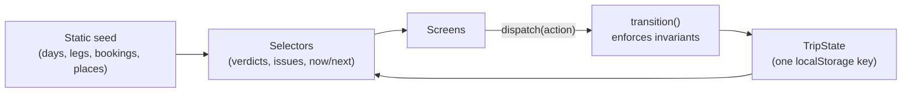

# TripCanvas

Turn the places you've saved into days you can actually live.

TripCanvas is a travel-planning prototype built around one question: **is this day realistic?** Every day of a
real 9-day Spain trip (with sanitized `DEMO-` booking references) gets a verdict (Comfortable, Full, Tight, or
Overloaded), the reasons for it, and the one change that helps most. The same verdict appears in Day Builder, the
Itinerary, and Trip Pulse, because all three read it from one place.

It's client-only: no backend, accounts, or AI. That's deliberate; see [docs/DECISIONS.md](docs/DECISIONS.md).

## Try it

```sh
pnpm install
pnpm run dev          # http://localhost:5173
```

The demo date is pinned to **Sat Jul 25, 2026**, three days before the trip. Add `?now=2026-07-28T14:00` to any URL
to live a moment of the trip.

**A five-minute walkthrough**

1. **Trip Pulse** (`/dashboard`): "Needs you" lists what's unresolved. Resolve one in place and every screen updates.
2. **Day Builder, Aug 1** (`/day/day-4`): move "Sa Tuna" to Planned and the day turns **Tight**, with reasons.
   "Move to Optional" makes it **Full** again. Pick a new anchor and the old one is demoted, announced, and undoable.
3. **Itinerary** (`/itinerary`): bases, legs, and the overnight DL128 on both days, with a small route diagram.
4. **Trip Mode** (`/trip-mode/day-0?now=2026-07-28T14:00`): the flight is Next, with the airport steps and a
   confirmation you can copy.
5. **Recovery**: in DevTools, set `localStorage["tripcanvas:state"]` to `{}` and reload. The demo resets and says so.

## How it works



- **Domain** (`lib/domain`): pure rules, no React. The day-load engine and its constants
  (`planning-heuristics.ts`) are documented in [docs/DAY_LOAD.md](docs/DAY_LOAD.md).
- **State** (`lib/state`): one reducer enforces 13 invariants (one anchor per day, booking truth, no stored derived
  facts, and more), returning effects the UI announces and can undo.
- **Selectors** (`lib/selectors`): every derived fact, memoized per state, so screens can't disagree.
- **Persistence** (`lib/persistence`): zod-validated, per-record salvage, v1/v2 migrations, never throws.
- **Layer rules** are enforced by ESLint. See [docs/ARCHITECTURE.md](docs/ARCHITECTURE.md).

## Quality gates

```sh
pnpm run typecheck    # app
pnpm run test:types   # tests are typechecked too
pnpm run lint         # includes the architecture import rules
pnpm run test         # unit, reducer, persistence, integration, axe on every route (jsdom)
pnpm run build
pnpm run e2e          # Playwright: the demo at 390×844 and 1440×900, axe incl. contrast, no console errors
```

CI (`.github/workflows/ci.yml`) runs all six.

## Claims ledger

Each claim this README or a portfolio write-up makes, and the evidence for it.

| Claim | Evidence |
|---|---|
| Screens can't disagree about a day | `selectors.test.ts` (cross-screen consistency); pages have no domain imports (`eslint.config.js`) |
| Verdicts are deterministic, monotonic, and explainable | `day-load.test.ts`: pinned verdicts for all 9 days, monotonicity, isolation, and "the suggestion improves the day" |
| Bad saved data never crashes the app | `load.test.ts` corruption table; e2e "corrupt storage" |
| Invariants hold after every action | `transition.test.ts` + `validateTripState` |
| Accessible to WCAG 2.2 AA criteria, tested | axe on 12 routes (jsdom) and 7 routes with contrast (Chromium); focus rules mutation-checked; manual log in [docs/ACCESSIBILITY.md](docs/ACCESSIBILITY.md) |
| No real booking references in the repo | `seed-policy.test.ts` (DEMO- pattern + hashed denylist) |
| Every declared dependency is used | Pruned from 69 to 34 dev dependencies in RFC-001 E11 |

**Claims not to make:** "WCAG compliant" (no screen-reader pass yet), "AI-powered", "syncs", or "production-ready".
Duration and energy numbers are heuristics, and the UI labels them as estimates.

## What's next / not planned

- **Next:** a VoiceOver and iPhone pass; self-host the two web fonts (today they load from Google Fonts, a
  third-party request); flatten `artifacts/travel-planner` to the repo root as a rename-only change.
- **Not planned:** accounts, sync, a map library, AI suggestions, bulk triage.

## Deploy

Any static host. Build with `pnpm run build`; the output is `artifacts/travel-planner/dist/public`.

## Docs

[ARCHITECTURE](docs/ARCHITECTURE.md) · [DECISIONS](docs/DECISIONS.md) · [DAY_LOAD](docs/DAY_LOAD.md) ·
[ACCESSIBILITY](docs/ACCESSIBILITY.md) · [design system](docs/design/SOFT_COASTAL_VISUAL_SYSTEM.md) ·
[archive](docs/archive/README.md)
