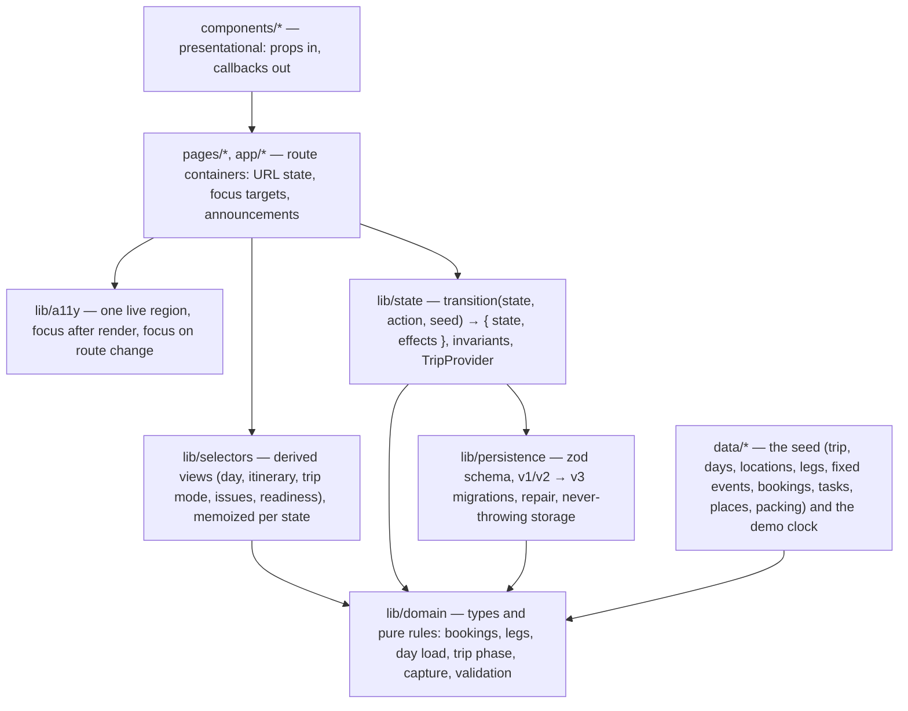

# Architecture

TripCanvas is a client-only React app. There is no backend, account, network API, or AI: the trip is static seed
data, and everything the traveler changes lives in one `localStorage` key. The interesting parts are a pure domain
layer, a single reducer that enforces the model's invariants, and derived views that every screen shares, so two
screens can't disagree.

All paths below are relative to `artifacts/travel-planner/src/`.

## Layers

### Import rules

Enforced by ESLint (`eslint.config.js`, `@typescript-eslint/no-restricted-imports` per directory; type-only imports
are allowed). `pnpm run lint` fails on a violation, and CI runs it.

| Directory | May not import | Why |
|---|---|---|
| `lib/domain` | React, state, persistence, selectors, data, UI | Pure rules, testable without a DOM or the seed |
| `data` | React, state, persistence, selectors, UI | Seed data depends on domain types only |
| `lib/persistence` | React, state, selectors, data, UI | The seed and legacy ID map are passed in |
| `lib/state` | selectors, UI | Transitions can't depend on derived views |
| `lib/selectors` | React, persistence, state, UI | Pure derivations over domain + state |
| `components` | state, selectors (values), persistence, data, pages, domain rule modules | Presentational |
| `pages`, `app` | persistence, seed modules, domain rule modules | Pages read through `useTrip()` and selectors (INV-5) |

## State ownership

| State | Owner | Persisted |
|---|---|---|
| Trip structure: days, bases, legs, fixed events, bookings, tasks, packing list | `data/seed` | No (static) |
| Places and their day assignments, booking confirmations entered by the traveler, resolved tasks, per-day progress, packed items | `TripState` via `transition()` | Yes, `tripcanvas:state` (version 3) |
| Verdicts, readiness, issues, "booked", trip phase, now/next | selectors | Never (INV-4) |
| Selected day in the Itinerary | the URL (`/itinerary/:dayId`) | — |
| Focus targets, announcements, open sheets, undo rows, a chosen backup in Trip Mode | the page | Never |
| The demo date | `?now=` override, remembered per tab in `sessionStorage` | Per tab |

`TripProvider` holds the state, runs `transition()` in `dispatch`, saves after each change, and reloads when another
tab writes the key. `dispatch` returns the transition's effects (`assignmentsChanged`, `anchorDemoted`, `rejected`) so
pages can announce changes and offer Undo without the state layer knowing about UI.

## Invariants

| ID | Rule | Enforced by |
|---|---|---|
| INV-1 | At most one anchor per day; choosing a new one demotes the old one to Planned in the same transition | `transition`, `validateTripState`, load repair |
| INV-2 | Travel days (flight, arrival, departure) never raise a missing-anchor issue | `isAnchorDayType`, day-load |
| INV-3 | Booking truth has one definition (`isBookingSecured`: a real confirmation, not a placeholder) | `lib/domain/bookings.ts` |
| INV-4 | Readiness, verdicts, issues, and phase are derived, never persisted | the zod schema has no such fields |
| INV-5 | No page or component computes a domain fact | lint rules above + the cross-screen consistency test |
| INV-6 | Only the anchor, planned plans, and fixed events count toward a day's load | `computeDayLoad` |
| INV-7 | A leg belongs to its departure day and appears on every day it touches (the overnight DL128 is on Jul 28 and Jul 29) | `legsForDay` |
| INV-8 | An activity has exactly one mutable representation: a `Place` | the model (no "flexible events") |
| INV-9 | An assignment is null or complete; a backup points at a plan on the same day | `validatePlaces`, `transition`, load repair |
| INV-10 | Progress is keyed by day; moving a place doesn't carry "done" with it | `TripState.progress`, `progressItemIds` |
| INV-11 | Every reference resolves; dangling ones are dropped at load and reported | load repair + recovery notice |
| INV-12 | No domain function reads the real clock; the clock is an argument | `data/demo-clock.ts`, `useDemoNow` |
| INV-13 | The seed has no real identifiers: confirmations match `/^DEMO-[A-Z0-9-]{4,}$/`, and a hashed denylist of known real references must not appear | `data/seed-policy.test.ts` |

INV-13 allows hyphens after the prefix (`DEMO-STAY-CEP`), a small deviation from the RFC's pattern.

## Persistence and failure

One key, `tripcanvas:state`, holds `{ version: 3, ...TripState }`. `loadState(storage, seed)` is pure given the storage
adapter and returns `{ state, recoveries }`:

| Stored value | Result | The traveler sees |
|---|---|---|
| Nothing | Seed | Nothing |
| Malformed JSON, wrong shape, unknown version | Reseed | "Saved demo data couldn't be read, so the demo was reset." |
| Some invalid places | Drop those, keep the rest | "2 saved places couldn't be restored." |
| v1 or v2 keys | Migrate through an explicit old→new ID map, remove old keys | Nothing |
| Storage unavailable or full | Keep working in memory | A persistent notice that changes won't be saved |

A render error is caught by an error boundary (app or page scope) that shows an `h1`, moves focus to it, and offers
"Reload" and "Reset demo data".

## The realistic-day engine

`lib/domain/day-load.ts` turns a day into a verdict (Comfortable, Full, Tight, or Overloaded), reason codes, and at
most one suggestion. It's deterministic and monotonic: adding a committed plan never improves a verdict. Every number
it uses is in `lib/domain/planning-heuristics.ts`, which is labelled as heuristic. See [DAY_LOAD.md](DAY_LOAD.md).

## Screens and their selectors

| Route | Question it answers | Selector |
|---|---|---|
| `/dashboard` (Trip Pulse) | What needs me? | `selectTripIssues`, `selectReadiness`, `selectDayViews` |
| `/itinerary/:dayId?` | How does the trip flow, night by night? | `selectItinerary`, `selectRouteDiagram` |
| `/day/:dayId` (Day Builder) | Is this day realistic? | `selectDayView`, `selectDayIdeas` |
| `/trip-mode/:dayId` | What do I need right now? | `selectTripMode` |
| `/inbox` | What have I saved that isn't placed yet? | `selectInbox` |
| `/logistics` | Which bookings are secured, and which need me? | `selectBookings` |
| `/packing` | What's left to pack? | `selectReadiness` |

The Itinerary's Route diagram is not a map: real coordinates are projected into a fixed SVG with no tiles, roads, or
zoom. It's labelled for screen readers, not focusable, and the timeline beside it is the accessible equivalent.

## Demo clock

The trip is Jul 28 – Aug 5, 2026, so "today" is pinned to Sat Jul 25, 2026, 10:00 (`data/demo-clock.ts`). Add
`?now=2026-07-28T14:00` to any URL to live a moment of the trip; the override is remembered for the tab. Trip Mode
previews other dates instead of pretending they are now.
